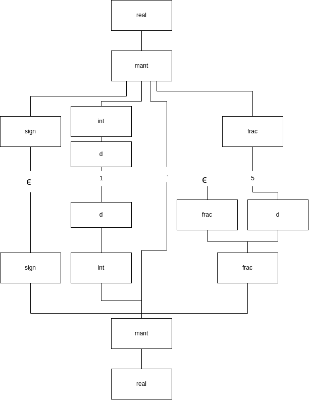
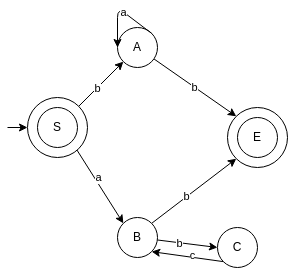
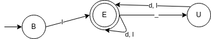
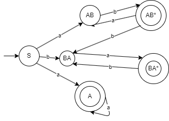

# 1. Kanonische Ableitung und Reduktion
## a) Leiten Sie aus dem Satzsymbol E einmal links- und einmal rechtskanonisch folgenden Satz ab:


```
- v * ( v + v / v )
```
### Linkskanonisch

<u>E</u>
⇒ -<u>T</u>
⇒ -<u>T</u>  * F
⇒ - <u>F</u> * F
⇒ -v * <u>F</u>
⇒  -v *(<u>E</u>)
⇒ -v * (<u>E</u> + T)
⇒ -v * (<u>T</u> + T)
⇒ -v * (<u>E</u> + T)
⇒ -v * (v + <u>T</u>)
⇒ -v * (v + <u>T</u>/F)
⇒ -v * (v + <u>F</u>/F) 
⇒ -v * (v + v/<u>F</u>)
⇒  -v * (v + v/v)

### Rechtskanonisch

<u>E</u>
⇒ -<u>T</u>
⇒ -T  * <u>F</u>
⇒ -T  * (<u>E</u>)
⇒ -T * (E + <u>T</u>)
⇒ -T * (E + T / <u>F</u>)
⇒ -T * (E + <u>T</u> / v)
⇒ -T * (E + <u>F</u> / v)
⇒ -T * (<u>E</u> + v / v)
⇒ -T * (<u>T</u> + v / v)
⇒ -T * (<u>F</u> + v / v)
⇒ -<u>T</u> * (v + v / v)
⇒ -<u>F</u> * (v + v / v)
⇒ -v * (v + v / v)

## b) Reduzieren Sie folgenden Satz

```
( ( v + v ) * v / v ) – ( v / v )
```

### Linkskanonisch

( ( <u>v</u> + v ) * v / v ) – ( v / v )   ⊢
( ( <u>F</u> + v ) * v / v ) – ( v / v )   ⊢
( ( <u>T</u> + v ) * v / v ) – ( v / v )   ⊢
( ( E + <u>v</u> ) * v / v ) – ( v / v )   ⊢
( ( E + <u>F</u> ) * v / v ) – ( v / v )   ⊢
( ( <u>E + T</u> ) * v / v ) – ( v / v )   ⊢
( <u>( E )</u> * v / v ) – ( v / v )       ⊢
(  <u>F</u>  * v / v ) – ( v / v )         ⊢
(  T  * <u>v</u> / v ) – ( v / v )         ⊢
(  <u>T  * F</u> / v ) – ( v / v )         ⊢
( <u>T/F</u> ) - ( v / v )                 ⊢
( <u>T</u> ) - ( v / v )                   ⊢
<u>( E )</u> - ( v / v )                   ⊢
<u>F</u> - ( v / v )                       ⊢
<u>T</u> - ( v / v )                       ⊢
E -( <u>v</u> / v)                         ⊢
E - ( <u>F</u> / v)                        ⊢
E - (T / <u>v</u>)                         ⊢
E - ( <u> T / F </u> )                     ⊢
E - ( <u>T</u> )                           ⊢
E - <u>(E)</u>                             ⊢
E - <u>F</u>                               ⊢
<u>E - T</u>                               ⊢
E                                          ⊢

### Rechtskanonisch
( ( v + v ) * v / v ) – ( v / <u>v</u> )   ⊢
( ( v + v ) * v / v ) – ( v / <u>T</u> )   ⊢
( ( v + v ) * v / v ) – ( <u>v</u> / F )   ⊢
( ( v + v ) * v / v ) – ( <u>F</u> / F )   ⊢
( ( v + v ) * v / v ) – ( <u>T / F</u> )   ⊢
( ( v + v ) * v / v ) – ( <u>T</u> )       ⊢
( ( v + v ) * v / v ) – <u>( E )</u>       ⊢
( ( v + v ) * v / v ) – <u>F</u>           ⊢
( ( v + v ) * v / <u>v</u> ) – T           ⊢
( ( v + v ) * <u>v</u> / F ) – T           ⊢
( ( v + v ) * <u>F</u> / F ) – T           ⊢
( ( v + v ) * <u>T / F</u> ) – T           ⊢
( ( v + v ) * <u>T / F</u> ) – T           ⊢
( ( v + <u>v</u> ) * T ) – T               ⊢
( ( v + <u>F</u> ) * T ) – T               ⊢
( ( <u>v</u> + T ) * T ) – T               ⊢
( ( <u>F</u> + T ) * T ) – T               ⊢
( ( <u>T</u> + T ) * T ) – T               ⊢
( ( <u>E + T</u> ) * T ) – T               ⊢
( <u>( E )</u> * T ) – T                   ⊢
( <u>F</u> * T ) – T                       ⊢
da ist der hund drin...verdammt
( <u>T * F</u> ) – T                       ⊢
( <u>T</u> ) – T                           ⊢
<u>( E )</u> – T                           ⊢
<u>F</u> – T                               ⊢
<u>T</u> – T                               ⊢
<u>E – T</u>                               ⊢
E                                          ⊢


# 2. Mehrdeutigkeit, Beschreibung und Schreibweisen
## a) Ist diese Grammatik mehrdeutig? Begründen Sie Ihre Antwort und transformieren Sie diese
Grammatik – wenn nötig – in eine äquivalente eindeutige Grammatik.
Nein, nicht eindeutig (es gibt für einen Satz mehr als einen Syntaxbaum)

```
frac -> frac d | ϵ
```

## b) Geben Sie eine möglichst kurze Grammatik für L(G(real)) in Wirth'scher EBNF an.
```
Real = [ "+" | "-"]
       d {d}
       ["."{d}]
       ["E" ["+" | "-"] d{d}]
d = "0" | "1" | "2" | "3" | "4" | "5" | "6" | "7" | "8" | "9"
```

# 3. Reguläre Grammatiken 



## a) Geben Sie eine äquivalente umgekehrt reguläre Grammatik an.


```
E -> A b | B b | ϵ
A -> b | A a
B -> a | C a
C -> B b 
```

## b) Geben Sie einen regulären Ausdruck an, der die Sprache dieser Grammatik beschreibt/erkennt
```
ϵ +
b a* b +
a (b a)* b 
```

# 4. Bezeichner in der Programmiersprache Ada



## a)

```
B -> l E | l
E -> _ U | d E | l E | d | l
U -> l E | d E | l | d
```

## b)
```
E -> l | E l | E d | U l | U d
U -> E _
```

## c)
```
l (_(d + l) + d + l)
```

# 5. Transformation zwischen Darstellungsformen regulärer Sprachen

## a)


### Nicht deterministischer Automat


|   | a | b |
| --- | --- | --- |
|▶S | {A, AB}  | {BA}  |
| A | {A }  | -  |
| AB | -  | {AB*}  |
| ○AB* | {AB}  | {BA}  |
| BA | {BA*}  | -  |
| ○BA* | -  | {BA}  |
| {A,AB} | {A}  | {AB*}  |


