## Aufgabe 1

### a) `XFA *faOf(const Grammar *g) z`

Die Funktion faOf() implementiert die Konvertierung einer regulären Grammatik in einen äquivalenten nichtdeterministischen endlichen Automaten (NFA).

**Lösungs-Idee:**
- Die NTs der Grammatik werden zu Zuständen im NFA
- Ein spezieller FINAL-Zustand wird für Terminalableitungen hinzugefügt
- Das Satzsymbol der Grammatik wird zum Startzustand des NFA
- Fall `A → ɛ` : Zustand `A` wird zu einem Endzustand
- Fall `A → a` : Erstelle Übergang vom Zustand `A` mit Symbol `a` zum `FINAL`-Zustand
- Fall `A → aB` : Erstelle Übergang vom Zustand `A` mit Symbol `a` zum Zustand `B`
- Fall `A → aA` : Wenn ein NT nur Regeln in dieser Form hat, wird `A` zum Endzustand

```cpp
// TASK 1a)
NFA* faOf(const Grammar* g) {
    FABuilder* builder = new FABuilder();
    builder->setStartState(g->root->name);
    for (const auto& rule : g->rules) {
        const NTSymbol* nt = rule.first;
        bool hasOnlySelfTransitions = true;
        for (const Sequence* seq : rule.second) {
            if(seq->isEpsilon()) { // Handle A → ε
                builder->addFinalState(nt->name);
            }
            if (seq->length() == 1) { // Handle A → a
                const Symbol* sym = seq->at(0);
                if (sym->isT()) {
                    builder->addFinalState("FINAL");
                    builder->addTransition(nt->name, sym->name[0], "FINAL");
                }
            }
            else if (seq->length() == 2) { // Handle A → aB
                const Symbol* first = seq->at(0);
                const Symbol* second = seq->at(1);
                if (first->isT() && second->isNT()) {
                    builder->addTransition(nt->name, first->name[0], second->name);
                }
            }
            // Handle A → aA
            if (seq->length() == 1 || (seq->length() == 2 && seq->at(1)->name != nt->name)) {
                hasOnlySelfTransitions = false;
            }
        }
        // A NT is a final state if it has only self-transitions
        if (hasOnlySelfTransitions && !rule.second.empty()) {
            builder->addFinalState(nt->name);
        }
    }
    NFA* result = builder->buildNFA();
    delete builder;
    return result;
}
```

### b) `Grammar *grammarOf(const XFA *xfa)`
Die Funktion grammarOf() konvertiert einen NFA zurück in eine reguläre Grammatik.

**Lösungs-Idee:**
- Die Zustände des NFA werden zu NTs in der Grammatik
- Der Startzustand des NFA wird zum Satzsymbol der Grammatik
- Wenn ein Zustand ein Endzustand ist und der Startzustand, füge Regel `A → ε` hinzu
- Eine Transition `A --a--> FINAL` wird zur Regel `A → a`
- Eine Transition `A --a--> B` wird zur Regel `A → aB`


## Aufgabe 4

### a)
```
ConstDef  → const Type ident Init OptNInits ;
Type      → bool | int
Init      → = Val
Val       → false | true | OptSign number
OptSign   → ε | + | - 
OptNInits → ε | , ident Init OptNInits   
```

### b)

S.1) Für jede Regel A → α einen Übergang δ(Z, ε, A) = (Z, αR):
```
Für ConstDef → const Type ident Init OptNInits ;

δ(Z, ε, ConstDef) = (Z, ; OptNInits Init ident Type const)

Für Type → bool | int

δ(Z, ε, Type) = (Z, bool)
δ(Z, ε, Type) = (Z, int)

Für Init → = Val

δ(Z, ε, Init) = (Z, Val =)

Für Val → false | true | OptSign number

δ(Z, ε, Val) = (Z, false)
δ(Z, ε, Val) = (Z, true)
δ(Z, ε, Val) = (Z, number OptSign)

Für OptSign → ε | + | -

δ(Z, ε, OptSign) = (Z, ε)
δ(Z, ε, OptSign) = (Z, +)
δ(Z, ε, OptSign) = (Z, -)

Für OptNInits → ε | , ident Init OptNInits

δ(Z, ε, OptNInits) = (Z, ε)
δ(Z, ε, OptNInits) = (Z, OptNInits Init ident ,)

```

S.2) Für jedes Terminalsymbol a einen Übergang δ(Z, a, a) = (Z, ε):

```

δ(Z, const, const) = (Z, ε)
δ(Z, bool, bool) = (Z, ε)
δ(Z, int, int) = (Z, ε)
δ(Z, ident, ident) = (Z, ε)
δ(Z, =, =) = (Z, ε)
δ(Z, false, false) = (Z, ε)
δ(Z, true, true) = (Z, ε)
δ(Z, number, number) = (Z, ε)
δ(Z, +, +) = (Z, ε)
δ(Z, -, -) = (Z, ε)
δ(Z, ,, ,) = (Z, ε)
δ(Z, ;, ;) = (Z, ε)
```

### c)

S.1) Für jede Regel A → α einen Übergang δ(Z, ε, α) = (Z, A):

```
Für ConstDef → const Type ident Init OptNInits ;

δ(Z, ε, const Type ident Init OptNInits ;) = (Z, ConstDef)

Für Type → bool | int

δ(Z, ε, bool) = (Z, Type)
δ(Z, ε, int) = (Z, Type)

Für Init → = Val

δ(Z, ε, = Val) = (Z, Init)

Für Val → false | true | OptSign number

δ(Z, ε, false) = (Z, Val)
δ(Z, ε, true) = (Z, Val)
δ(Z, ε, OptSign number) = (Z, Val)

Für OptSign → ε | + | -

δ(Z, ε, ε) = (Z, OptSign)
δ(Z, ε, +) = (Z, OptSign)
δ(Z, ε, -) = (Z, OptSign)

Für OptNInits → ε | , ident Init OptNInits

δ(Z, ε, ε) = (Z, OptNInits)
δ(Z, ε, , ident Init OptNInits) = (Z, OptNInits)
```

S.2) Für jedes Terminalsymbol a und jedes x ∈ V ∪ {$}:

V = {`ConstDef`, `Type`, `Init`, `Val`, `OptSign`, `OptNInits`, `const`, `bool`, `int`, `ident`, `=`, `false`, `true`, `number`, `+`, `-`, `,` , `;`}

```
Für const:
δ(Z, const, x) = (Z, x const) für alle x ∈ V ∪ {$}

Für bool:
δ(Z, bool, x) = (Z, x bool) für alle x ∈ V ∪ {$}

Für int:
δ(Z, int, x) = (Z, x int) für alle x ∈ V ∪ {$}

Für ident:
δ(Z, ident, x) = (Z, x ident) für alle x ∈ V ∪ {$}

Für =:
δ(Z, =, x) = (Z, x =) für alle x ∈ V ∪ {$}

Für false:
δ(Z, false, x) = (Z, x false) für alle x ∈ V ∪ {$}

Für true:
δ(Z, true, x) = (Z, x true) für alle x ∈ V ∪ {$}

Für number:
δ(Z, number, x) = (Z, x number) für alle x ∈ V ∪ {$}

Für +:
δ(Z, +, x) = (Z, x +) für alle x ∈ V ∪ {$}

Für -:
δ(Z, -, x) = (Z, x -) für alle x ∈ V ∪ {$}

Für ,:
δ(Z, ,, x) = (Z, x ,) für alle x ∈ V ∪ {$}

Für ;:
δ(Z, ;, x) = (Z, x ;) für alle x ∈ V ∪ {$}
```

Beispielhaft wurde `const` evaluiert:
```
δ(Z, const, $) = (Z, $ const)
δ(Z, const, ConstDef) = (Z, ConstDef const)
δ(Z, const, Type) = (Z, Type const)
δ(Z, const, Init) = (Z, Init const)
δ(Z, const, Val) = (Z, Val const)
δ(Z, const, OptSign) = (Z, OptSign const)
δ(Z, const, OptNInits) = (Z, OptNInits const)
δ(Z, const, const) = (Z, const const)
δ(Z, const, bool) = (Z, bool const)
δ(Z, const, int) = (Z, int const)
δ(Z, const, ident) = (Z, ident const)
δ(Z, const, =) = (Z, = const)
δ(Z, const, false) = (Z, false const)
δ(Z, const, true) = (Z, true const)
δ(Z, const, number) = (Z, number const)
δ(Z, const, +) = (Z, + const)
δ(Z, const, -) = (Z, - const)
δ(Z, const, ,) = (Z, , const)
δ(Z, const, ;) = (Z, ; const)
```

S.3) Den Übergang für das Ende:

```
δ(Z, ε, $ConstDef) = (R, ε)
```

### d)



## Aufgabe 5
### a)

Terminale Anfänge der Länge 1
```
First1(progmod) = { MODULE }
First1(priority) = { const, ε }
First1(imppart) = { FROM, IMPORT }
First1(implist) = { id }
First1(block) = { DECL, BEGIN }
First1(dclpart) = { DECL }
First1(statpart) = { BEGIN }
First1(statseq) = { STAT }
```

terminale Nachfolger der Länge 1
```
Follow1(progmod) = { }
Follow1(priority) = { ; }
Follow1(imppart) = { DECL, BEGIN }
Follow1(implist) = { id, DECL, BEGIN }
Follow1(block) = { id }
Follow1(dclpart) = { DECL, BEGIN }
Follow1(statpart) = { id }
Follow1(statseq) = { STAT, ; }
```
>Annahme: Das Satzsymbol `progmod` hat keinen terminalen Nachfolger.

### b)

Ja, LL(k) k=2.
Folgende Nonterminalsymbole bieten nach dem Betrachten der ersten Terminalsymbole keine eindeutigen Alternativen:
- `implist`
- `dclpart`
- `statseq`

### c)

```
progmod → MODULE id : priority ; imppart block id .
priority → const | ε
imppart → FROM id IMPORT implist | IMPORT implist 
implist → id implist'
implist' → , id implist' | ε
block → dclpart statpart | statpart
dclpart → DECL dclpart'
dclpart' → ; DECL dclpart' | ε
statpart → BEGIN statseq END
statseq → STAT statseq'
statseq' → ; STAT statseq' | ε
```

```
First1(progmod) = { MODULE }
First1(priority) = { const, ε }
First1(imppart) = { FROM, IMPORT }
First1(implist) = { id }
First1(implist') = { ',' , ε }
First1(block) = { DECL, BEGIN }
First1(dclpart) = { DECL }
First1(dclpart') = { ; , ε }
First1(statpart) = { BEGIN }
First1(statseq) = { STAT }
First1(statseq') = { ; , ε }
```

```
Follow1(progmod) = { }
Follow1(priority) = { ; }
Follow1(imppart) = { DECL, BEGIN }
Follow1(implist) = { DECL, BEGIN }
Follow1(implist') = { DECL, BEGIN }
Follow1(block) = { id }
Follow1(dclpart) = { BEGIN }
Follow1(dclpart') = { BEGIN }
Follow1(statpart) = { id }
Follow1(statseq) = { END }
Follow1(statseq') = { END }
```

Wir betrachten die abgeänderten Regeln:
```
implist → id implist' (nur eine Alternative) LL1 ✓
dclpart → DECL dclpart' (nur eine Alternative) LL1 ✓
statseq → STAT statseq' (nur eine Alternative) LL1 ✓

implist' → , id implist' | ε
Da die zweite Alternative ε produziert, muss gelten:
First1(, id implist') ∩ Follow1(implist') = {','} ∩ {DECL, BEGIN} = { } LL1✓

dclpart' → ; DECL dclpart' | ε
Da die zweite Alternative ε produziert, muss gelten:
First1(; DECL dclpart') ∩ Follow1(dclpart') = {';'} ∩ {BEGIN} = { } LL1✓

statseq' → ; STAT statseq' | ε
Da die zweite Alternative ε produziert, muss gelten:
First1(; STAT statseq') ∩ Follow1(statseq') = {';'} ∩ {END} = { } LL1✓
```
