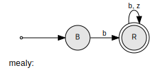
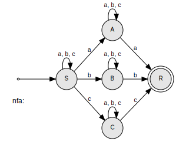
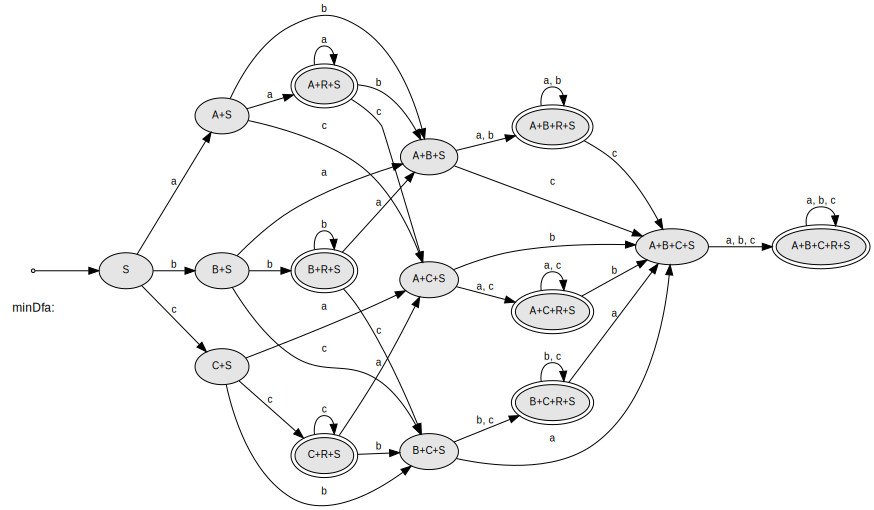

## Aufgabe 1

### a) `XFA *faOf(const Grammar *g) z`

Die Funktion faOf() implementiert die Konvertierung einer regulären Grammatik in einen äquivalenten nichtdeterministischen endlichen Automaten (NFA).

**Lösungs-Idee:**
- Die NTs der Grammatik werden zu Zuständen im NFA
- Ein spezieller FINAL-Zustand wird für Terminalableitungen hinzugefügt
- Das Satzsymbol der Grammatik wird zum Startzustand des NFA
- Fall `A → ɛ` : Zustand `A` wird zu einem Endzustand
- Fall `A → a` : Erstelle Übergang vom Zustand `A` mit Symbol `a` zum `FINAL`-Zustand
- Fall `A → aB` : Erstelle Übergang vom Zustand `A` mit Symbol `a` zum Zustand `B`
- Fall `A → aA` : Wenn ein NT nur Regeln in dieser Form hat, wird `A` zum Endzustand

### b) `Grammar *grammarOf(const XFA *xfa)`
Die Funktion grammarOf() konvertiert einen NFA zurück in eine reguläre Grammatik.

**Lösungs-Idee:**
- Die Zustände des NFA werden zu NTs in der Grammatik
- Der Startzustand des NFA wird zum Satzsymbol der Grammatik
- Wenn ein Zustand ein Endzustand ist und der Startzustand, füge Regel `A → ε` hinzu
- Eine Transition `A --a--> FINAL` wird zur Regel `A → a`
- Eine Transition `A --a--> B` wird zur Regel `A → aB`


### Implementierung

```cpp
using namespace std;
#include <iostream>
#include "SignalHandling.h"
#include "Timer.h"
#include "SymbolStuff.h"
#include "SequenceStuff.h"
#include "Vocabulary.h"
#include "GrammarBasics.h"
#include "GrammarBuilder.h"
#include "Grammar.h"
#include "Language.h"
#include "TapeStuff.h"
#include "StateStuff.h"
#include "MbMatrix.h"
#include "DeltaStuff.h"
#include "FA.h"
#include "DFA.h"
#include "NFA.h"
#include "MooreDFA.h"
#include "FABuilder.h"
#include "GraphVizUtil.h"

// Activation (with 1) allows simple builds via command line
// * for GNU   use:  g++      -std=c++17 Main.cpp
// * for Clang use:  clang++  -std=c++17 Main.cpp
// * for M.S.  use:  cl /EHsc /std:c++17 Main.cpp
#if 1
#include "SignalHandling.cpp"
#include "Timer.cpp"
#include "SymbolStuff.cpp"
#include "SequenceStuff.cpp"
#include "GrammarBasics.cpp"
#include "GrammarBuilder.cpp"
#include "Grammar.cpp"
#include "Language.cpp"
#include "TapeStuff.cpp"
#include "StateStuff.cpp"
#include "MbMatrix.cpp"
#include "DeltaStuff.cpp"
#include "FA.cpp"
#include "DFA.cpp"
#include "NFA.cpp"
#include "MooreDFA.cpp"
#include "FABuilder.cpp"
#include "GraphVizUtil.cpp"
#endif

// TASK 1a)
NFA* faOf(const Grammar* g) {
    FABuilder* builder = new FABuilder();
    builder->setStartState(g->root->name);
    for (const auto& rule : g->rules) {
        const NTSymbol* nt = rule.first;
        bool hasOnlySelfTransitions = true;
        for (const Sequence* seq : rule.second) {
            if(seq->isEpsilon()) { // Handle A → ε
                builder->addFinalState(nt->name);
            }
            if (seq->length() == 1) { // Handle A → a
                const Symbol* sym = seq->at(0);
                if (sym->isT()) {
                    builder->addFinalState("FINAL");
                    builder->addTransition(nt->name, sym->name[0], "FINAL");
                }
            }
            else if (seq->length() == 2) { // Handle A → aB
                const Symbol* first = seq->at(0);
                const Symbol* second = seq->at(1);
                if (first->isT() && second->isNT()) {
                    builder->addTransition(nt->name, first->name[0], second->name);
                }
            }
            // Handle A → aA
            if (seq->length() == 1 || (seq->length() == 2 && seq->at(1)->name != nt->name)) {
                hasOnlySelfTransitions = false;
            }
        }
        // A NT is a final state if it has only self-transitions
        if (hasOnlySelfTransitions && !rule.second.empty()) {
            builder->addFinalState(nt->name);
        }
    }
    NFA* result = builder->buildNFA();
    delete builder;
    return result;
}

// TASK 1b)
Grammar* grammarOf(const NFA* nfa) {
    SymbolPool* sp = new SymbolPool();
    GrammarBuilder* builder = new GrammarBuilder(sp->ntSymbol(nfa->s1));

    for (const State& state : nfa->S) {
        // A → ε
        if (state == nfa->s1 && nfa->F.contains(state)) {
            bool hasFinalTransition = false;
            for (const TapeSymbol& sym : nfa->V) {
                if (nfa->delta[state][sym].contains("FINAL")) {
                    hasFinalTransition = true;
                    break;
                }
            }
            if (!hasFinalTransition) {
                builder->addRule(sp->ntSymbol(state), new Sequence());
            }
        }

        for (const TapeSymbol& sym : nfa->V) {
            StateSet nextStates = nfa->delta[state][sym];
            for (const State& nextState : nextStates) {
                // A → aB
                if (nextState != "FINAL") {
                    builder->addRule(sp->ntSymbol(state),
                                   new Sequence({sp->tSymbol(string(1, sym)),
                                               sp->ntSymbol(nextState)}));
                }
                // A → a
                else {
                    builder->addRule(sp->ntSymbol(state),
                                   new Sequence({sp->tSymbol(string(1, sym))}));
                }
            }
        }
    }
    Grammar* result = builder->buildGrammar();
    delete sp;
    delete builder;
    return result;
}


int main(int argc, char *argv[]) {
    installSignalHandlers();
    startTimer();
    // test grammars
    const char* grammarStrings[4] = {
        // grammar 1
        "G(S): \n\
        S -> b A | a B | eps \n\
        A -> b A | b \n\
        B -> b C | b \n\
        C -> a B",
        // grammar 2
        "G(S): \n\
        S -> a B \n\
        A -> b B | eps \n\
        B -> c C | a \n\
        C -> a A | b",
        // grammar 3
        "G(S): \n\
        S -> 0 A | 1 B \n\
        A -> 0 E | 1 B \n\
        B -> 0 C | 1 B \n\
        E -> 0 E | 1 E \n\
        C -> 0 E | 1 S",
        // grammar 4
        "G(S):              \n\
        S -> a A | b S               \n\
        A -> a A | b"
    };

    SymbolPool *sp = new SymbolPool();
    GrammarBuilder *gb = nullptr;
    Grammar *g = nullptr;
    Grammar *g1 = nullptr;
    for(int i = 0; i < 4; i++) {
        gb = new GrammarBuilder(grammarStrings[i]);
        g = gb->buildGrammar();
        cout << "grammar" << i + 1 << " from string-literal:" << endl << *g;
        NFA* nfa = faOf(g);
        cout << "Converted NFA" << i + 1 <<  ":" << endl << *nfa;
        vizualizeFA("nfa", nfa);
        Grammar* g1 = grammarOf(nfa);
        cout << "grammar" << i + 1 <<  " from nfa:" << endl << *g1;
        delete nfa;
        delete g;
        delete g1;
        delete gb;

        cout << "----------------------------------------------------------------" << endl;
    }

    delete sp;
    stopTimer();
    cout << "elapsed time: " << elapsedTime() << endl;
    cout << endl;
    cout << "END Main" << endl;

}
```

#### Ergebnisse

##### Grammatik1 -> NFA1 -> Grammatik1

```
grammar1 from string-literal:

G(S):
S -> eps | a B | b A
B -> b | b C
A -> b | b A
C -> a B
---
VNt = { A, B, C, S }, deletable: { S }
VT  = { a, b }

Converted NFA1:
-> () S -> a B | b A
      B -> b C | b FINAL
      A -> b A | b FINAL
      C -> a B
   () FINAL

writing    nfa to nfa.gv ...
rendering  nfa.gv to nfa.gv.svg ...
displaying nfa.gv.svg ...
Opening in existing browser session.

grammar1 from nfa:

G(S):
S -> eps | a B | b A
B -> b | b C
A -> b | b A
C -> a B
---
VNt = { A, B, C, S }, deletable: { S }
VT  = { a, b }

----------------------------------------------------------------
```


##### Grammatik2 -> NFA2 -> Grammatik2

```
grammar2 from string-literal:

G(S):
S -> a B
B -> a | c C
C -> a A | b
A -> eps | b B
---
VNt = { A, B, C, S }, deletable: { A }
VT  = { a, b, c }

Converted NFA2:
->    S -> a B
      B -> a FINAL | c C
      C -> a A | b FINAL
   () A -> b B
   () FINAL

writing    nfa to nfa.gv ...
rendering  nfa.gv to nfa.gv.svg ...
displaying nfa.gv.svg ...
Opening in existing browser session.

grammar2 from nfa:

G(S):
S -> a B
B -> a | c C
C -> a A | b
A -> b B
---
VNt = { A, B, C, S }, deletable: {  }
VT  = { a, b, c }

----------------------------------------------------------------
```


##### Grammatik3 -> NFA3 -> Grammatik3

```
grammar3 from string-literal:

G(S):
S -> 0 A | 1 B
A -> 0 E | 1 B
B -> 0 C | 1 B
E -> 0 E | 1 E
C -> 0 E | 1 S
---
VNt = { A, B, C, E, S }, deletable: {  }
VT  = { 0, 1 }

Converted NFA3:
->    S -> 0 A | 1 B
      A -> 0 E | 1 B
      B -> 0 C | 1 B
   () E -> 0 E | 1 E
      C -> 0 E | 1 S

writing    nfa to nfa.gv ...
rendering  nfa.gv to nfa.gv.svg ...
displaying nfa.gv.svg ...
Opening in existing browser session.

grammar3 from nfa:

G(S):
S -> 0 A | 1 B
A -> 0 E | 1 B
B -> 0 C | 1 B
E -> 0 E | 1 E
C -> 0 E | 1 S
---
VNt = { A, B, C, E, S }, deletable: {  }
VT  = { 0, 1 }

----------------------------------------------------------------
```


##### Grammatik4 -> NFA4 -> Grammatik4

```
grammar4 from string-literal:

G(S):
S -> a A | b S
A -> a A | b
---
VNt = { A, S }, deletable: {  }
VT  = { a, b }

Converted NFA4:
->    S -> a A | b S
      A -> a A | b FINAL
   () FINAL

writing    nfa to nfa.gv ...
rendering  nfa.gv to nfa.gv.svg ...
displaying nfa.gv.svg ...
Opening in existing browser session.

grammar4 from nfa:

G(S):
S -> a A | b S
A -> a A | b
---
VNt = { A, S }, deletable: {  }
VT  = { a, b }

----------------------------------------------------------------
```


## Aufgabe 2
### a)
**Lösungs-Idee:**
- Mittels `FABuilder` wird der Automat gemäß der Angabe-Grafik modelliert.

### b)
Für die Übersetzungsaufgabe wird ein Mealy-Automat entworfen. Da bei jedem Übergang eine Ausgabe erzeugt wird, eignet er sich gut für diesen Anwendungsfall.

**Lösungs-Idee:**
- `MealyDFA` erbt von der `DFA`-Klasse und erweitert diese um eine Ausgabefunktion (`lambda`). 
- Erweiterung zu `DFA`:
    - Der `DFA` entscheidet nur, ob eine Eingabe akzeptiert wird oder nicht
    - Der `MealyDFA` produziert zusätzlich bei jedem Übergang eine Ausgabe
- Die Ausgabefunktion (`lambda`) wird als verschachtelte Map implementiert
    - Der äußere Key ist der aktuelle Zustand (Typ `State`)
    - Der innere Key ist das gelesene Eingabesymbol (Typ `TapeSymbol`)
    - Der Wert ist das auszugebende Symbol (Typ `char`)
- Die accepts()-Methode wird überschrieben, um die Transformation durchzuführen:
    - Bei jedem Übergang wird geprüft, ob für die aktuelle Zustand-Symbol-Kombination eine Ausgabe definiert ist
    - Wenn ja, wird das entsprechende Ausgabesymbol über cout ausgegeben
    - Sie folgt dem normalen DFA-Verhalten zum Traversieren der Zustände

### Implementierung

```cpp
#ifndef MEALYDFA_H
#define MEALYDFA_H

#include <map>
#include "DFA.h"

class MealyDFA : public DFA {
private:
    map<State, map<TapeSymbol, char>> lambda;

public:
    MealyDFA(const StateSet &S,  const TapeSymbolSet &V,
             const State    &s1, const StateSet      &F,
             const DDelta   &delta,
             const map<State, map<TapeSymbol, char>> &lambda);

    virtual ~MealyDFA() = default;

    bool accepts(const Tape &tape) const override;

    const map<State, map<TapeSymbol, char>>& getLambda() const {
        return lambda;
    }
};

#endif //MEALYDFA_H
```
```cpp
#include <iostream>
#include "MealyDFA.h"

MealyDFA::MealyDFA(const StateSet &S,  const TapeSymbolSet &V,
                   const State    &s1, const StateSet      &F,
                   const DDelta   &delta,
                   const map<State, map<TapeSymbol, char>> &lambda)
    : DFA(S, V, s1, F, delta), lambda(lambda) {
}

bool MealyDFA::accepts(const Tape &tape) const {
    int i = 0;
    TapeSymbol tSy = tape[i];
    State s = s1;
    while (tSy != eot) {
        if (!defined(delta[s][tSy])) {
            return false;
        }
        if (lambda.count(s) > 0 && lambda.at(s).count(tSy) > 0) {
            std::cout << lambda.at(s).at(tSy);
        }
        s = delta[s][tSy];
        i++;
        tSy = tape[i];
    }
    return F.contains(s);
}
```
```cpp
using namespace std;

#include <iostream>
#include "SignalHandling.h"
#include "Timer.h"
#include "SymbolStuff.h"
#include "SequenceStuff.h"
#include "Vocabulary.h"
#include "GrammarBasics.h"
#include "GrammarBuilder.h"
#include "Grammar.h"
#include "Language.h"
#include "TapeStuff.h"
#include "StateStuff.h"
#include "MbMatrix.h"
#include "DeltaStuff.h"
#include "FA.h"
#include "DFA.h"
#include "NFA.h"
#include "MooreDFA.h"
#include "FABuilder.h"
#include "GraphVizUtil.h"
#include "MealyDFA.h"

// Activation (with 1) allows simple builds via command line
// * for GNU   use:  g++      -std=c++17 Main.cpp
// * for Clang use:  clang++  -std=c++17 Main.cpp
// * for M.S.  use:  cl /EHsc /std:c++17 Main.cpp
#if 1
#include "SignalHandling.cpp"
#include "Timer.cpp"
#include "SymbolStuff.cpp"
#include "SequenceStuff.cpp"
#include "GrammarBasics.cpp"
#include "GrammarBuilder.cpp"
#include "Grammar.cpp"
#include "Language.cpp"
#include "TapeStuff.cpp"
#include "StateStuff.cpp"
#include "MbMatrix.cpp"
#include "DeltaStuff.cpp"
#include "FA.cpp"
#include "DFA.cpp"
#include "NFA.cpp"
#include "MooreDFA.cpp"
#include "FABuilder.cpp"
#include "GraphVizUtil.cpp"
#include "MealyDFA.cpp"
#endif

int main() {
    FABuilder* builder = new FABuilder();
    builder->setStartState("B");
    builder->addFinalState("R");
    builder->addTransition("B", 'b', "R");
    builder->addTransition("R", 'b', "R");
    builder->addTransition("R", 'z', "R");
    DFA* baseDfa = builder->buildDFA();

    // Output mapping for MealyDFA
    map<State, map<TapeSymbol, char>> lambda = {
        {"B", {{'b', 'c'}}},
        {"R", {{'b', 'c'}, {'z', 'd'}}}
    };
    MealyDFA* mealyDFA = new MealyDFA(
        baseDfa->S,
        baseDfa->V,
        baseDfa->s1,
        baseDfa->F,
        baseDfa->delta,
        lambda
    );
    vizualizeFA("mealy", mealyDFA);

    // Tests
    cout << "Translate 'b' to 'c':" << endl;
    mealyDFA->accepts("b");
    cout << endl;
    cout << "Translate 'bzzb' to 'cddc':" << endl;
    mealyDFA->accepts("bzzb");
    cout << endl;
    delete mealyDFA;
    delete baseDfa;
    delete builder;
    return 0;
}
```


```
Translate 'b' to 'c':
c
Translate 'bzzb' to 'cddc':
cddc
```

### Aufgabe 3
### a)
**Lösungs-Idee:**
- Mittels `FABuilder` wird der Automat gemäß der Angabe-Grafik modelliert. Die bereites vorhandenen `accepts`-Methoden der `NFA`-Klasse werden aufgerufen.

### b)
Die bereits vorhande `Timer`-Klasse wird verwendet. Die einzige notwendige Abänderung dieser Klasse ist das Abändern der Genauigkeit von `elapsedTime()` von Millisekunden auf Mikrosekunden.

### c)
Die Methode `dfaOf()` der `NFA`-Klasse wird verwendet.

### d)
Die Methode `minimalOf()` der `DFA`-Klasse wird verwendet. Danach erfolgt ein visueller Vergleich.

### Implementierung

```cpp
#include <cstdio>
#include <iomanip>
#include <iostream>
#include <typeinfo>
using namespace std;

#include "SignalHandling.h"
#include "Timer.h"
#include "SymbolStuff.h"
#include "SequenceStuff.h"
#include "Vocabulary.h"
#include "GrammarBasics.h"
#include "GrammarBuilder.h"
#include "Grammar.h"
#include "Language.h"
#include "TapeStuff.h"
#include "StateStuff.h"
#include "MbMatrix.h"
#include "DeltaStuff.h"
#include "FA.h"
#include "DFA.h"
#include "NFA.h"
#include "MooreDFA.h"
#include "FABuilder.h"
#include "GraphVizUtil.h"
#include "MealyDFA.h"

// Activation (with 1) allows simple builds via command line
// * for GNU   use:  g++      -std=c++17 Main.cpp
// * for Clang use:  clang++  -std=c++17 Main.cpp
// * for M.S.  use:  cl /EHsc /std:c++17 Main.cpp
#if 1
#include "SignalHandling.cpp"
#include "Timer.cpp"
#include "SymbolStuff.cpp"
#include "SequenceStuff.cpp"
#include "GrammarBasics.cpp"
#include "GrammarBuilder.cpp"
#include "Grammar.cpp"
#include "Language.cpp"
#include "TapeStuff.cpp"
#include "StateStuff.cpp"
#include "MbMatrix.cpp"
#include "DeltaStuff.cpp"
#include "FA.cpp"
#include "DFA.cpp"
#include "NFA.cpp"
#include "MooreDFA.cpp"
#include "FABuilder.cpp"
#include "GraphVizUtil.cpp"
#include "MealyDFA.cpp"
#endif

int main() {
    cout << "NFA Test Program" << endl;
    cout << "----------------" << endl;

    FABuilder fab;
    // State S
    fab.addTransition("S", 'a', "A");  // S -a-> A
    fab.addTransition("S", 'b', "B");  // S -b-> B
    fab.addTransition("S", 'c', "C");  // S -c-> C
    fab.addTransition("S", 'a', "S");  // S -a-> S (self loop)
    fab.addTransition("S", 'b', "S");  // S -b-> S (self loop)
    fab.addTransition("S", 'c', "S");  // S -c-> S (self loop)

    // State A
    fab.addTransition("A", 'a', "A");  // A -a-> A (self loop)
    fab.addTransition("A", 'b', "A");  // A -b-> A (self loop)
    fab.addTransition("A", 'c', "A");  // A -c-> A (self loop)
    fab.addTransition("A", 'a', "R");  // A -a-> R

    // State B
    fab.addTransition("B", 'a', "B");  // B -a-> B (self loop)
    fab.addTransition("B", 'b', "B");  // B -b-> B (self loop)
    fab.addTransition("B", 'c', "B");  // B -c-> B (self loop)
    fab.addTransition("B", 'b', "R");  // B -b-> R

    // State C
    fab.addTransition("C", 'a', "C");  // C -a-> C (self loop)
    fab.addTransition("C", 'b', "C");  // C -b-> C (self loop)
    fab.addTransition("C", 'c', "C");  // C -c-> C (self loop)
    fab.addTransition("C", 'c', "R");  // C -c-> R

    // Set start and final states
    fab.setStartState("S");
    fab.addFinalState("R");

    NFA* nfa = fab.buildNFA();
    vizualizeFA("nfa", nfa);

    DFA* dfa = nfa->dfaOf();
    vizualizeFA("dfa", dfa);

    DFA* minDfa = dfa->minimalOf();
    vizualizeFA("minDfa", minDfa);

    const char* testStrings[] = {
        "aa",       // Minimal accepting string
        "aaaaaaaa", // Long string with lots of self-loops
        "abcabcabc",// many state changes
        "abcabcz",  // Invalid string
        "abc",      // Non-accepting valid string
        ""          // Empty string
    };

    for (const char* str : testStrings) {
        cout << "\nTesting string \"" << str << "\":" << endl;
        cout << "----------------------------------------" << endl;

        // Test accepts1 (Multithreading)
        startTimer();
        bool result1 = nfa->accepts1(str);
        stopTimer();
        cout << "accepts1 (Multithreading): "
             << (result1 ? "accepted" : "rejected")
             << " [Time: " << elapsedTime() << " microseconds]" << endl;

        // Test accepts2 (Backtracking)
        startTimer();
        bool result2 = nfa->accepts2(str);
        stopTimer();
        cout << "accepts2 (Backtracking):   "
             << (result2 ? "accepted" : "rejected")
             << " [Time: " << elapsedTime() << " microseconds]" << endl;

        // Test accepts3 (State Sets)
        startTimer();
        bool result3 = nfa->accepts3(str);
        stopTimer();
        cout << "accepts3 (State Sets):     "
             << (result3 ? "accepted" : "rejected")
             << " [Time: " << elapsedTime() << " microseconds]" << endl;

        if ((result1 != result2) || (result2 != result3)) {
            cout << "WARNING: Inconsistent results between methods!" << endl;
        }
    }

    cout << "\nPerformance test with long string:" << endl;
    cout << "----------------------------------------" << endl;

    // long string with many self-loops
    string longStr = "a";
    for(int i = 0; i < 200; i++) {
        longStr += "a";
    }
    longStr += "a";

    cout << "Testing string of length " << longStr.length() << ":" << endl;

    startTimer();
    nfa->accepts1(longStr);
    stopTimer();
    cout << "accepts1 time: " << elapsedTime() << " microseconds" << endl;

    startTimer();
    nfa->accepts2(longStr);
    stopTimer();
    cout << "accepts2 time: " << elapsedTime() << " microseconds" << endl;

    startTimer();
    nfa->accepts3(longStr);
    stopTimer();
    cout << "accepts3 time: " << elapsedTime() << " microseconds" << endl;

    delete nfa;
    delete dfa;
    delete minDfa;
    return 0;
}
```

### Konsolenausgabe
```
NFA Test Program
----------------
writing    nfa to nfa.gv ...
rendering  nfa.gv to nfa.gv.svg ...
displaying nfa.gv.svg ...
Opening in existing browser session.

writing    dfa to dfa.gv ...
rendering  dfa.gv to dfa.gv.svg ...
displaying dfa.gv.svg ...
Opening in existing browser session.

writing    minDfa to minDfa.gv ...
rendering  minDfa.gv to minDfa.gv.svg ...
displaying minDfa.gv.svg ...
Opening in existing browser session.


Testing string "aa":
----------------------------------------
accepts1 (Multithreading): accepted [Time: 574 microseconds]
accepts2 (Backtracking):   accepted [Time: 6 microseconds]
accepts3 (State Sets):     accepted [Time: 43 microseconds]

Testing string "aaaaaaaa":
----------------------------------------
accepts1 (Multithreading): accepted [Time: 3609 microseconds]
accepts2 (Backtracking):   accepted [Time: 10 microseconds]
accepts3 (State Sets):     accepted [Time: 79 microseconds]

Testing string "abcabcabc":
----------------------------------------
accepts1 (Multithreading): accepted [Time: 2374 microseconds]
accepts2 (Backtracking):   accepted [Time: 21 microseconds]
accepts3 (State Sets):     accepted [Time: 104 microseconds]

Testing string "abcabcz":
----------------------------------------
accepts1 (Multithreading): rejected [Time: 1191 microseconds]
accepts2 (Backtracking):   rejected [Time: 20 microseconds]
accepts3 (State Sets):     rejected [Time: 67 microseconds]

Testing string "abc":
----------------------------------------
accepts1 (Multithreading): rejected [Time: 351 microseconds]
accepts2 (Backtracking):   rejected [Time: 7 microseconds]
accepts3 (State Sets):     rejected [Time: 44 microseconds]

Testing string "":
----------------------------------------
accepts1 (Multithreading): rejected [Time: 1 microseconds]
accepts2 (Backtracking):   rejected [Time: 0 microseconds]
accepts3 (State Sets):     rejected [Time: 5 microseconds]

Performance test with long string:
----------------------------------------
Testing string of length 202:
accepts1 time: 1.56782e+06 microseconds
accepts2 time: 337 microseconds
accepts3 time: 2438 microseconds
```

### Grafische Ausgabe der Automaten

### a)


### c)


### d)


:white_check_mark: Der erstellte Automat in **c)** ist bereits minimal.

## Aufgabe 4

### a)
```
ConstDef  → const Type ident Init OptNInits ;
Type      → bool | int
Init      → = Val
Val       → false | true | OptSign number
OptSign   → ε | + | - 
OptNInits → ε | , ident Init OptNInits   
```

### b)

S.1) Für jede Regel A → α einen Übergang δ(Z, ε, A) = (Z, αR):
```
Für ConstDef → const Type ident Init OptNInits ;

δ(Z, ε, ConstDef) = (Z, ; OptNInits Init ident Type const)

Für Type → bool | int

δ(Z, ε, Type) = (Z, bool)
δ(Z, ε, Type) = (Z, int)

Für Init → = Val

δ(Z, ε, Init) = (Z, Val =)

Für Val → false | true | OptSign number

δ(Z, ε, Val) = (Z, false)
δ(Z, ε, Val) = (Z, true)
δ(Z, ε, Val) = (Z, number OptSign)

Für OptSign → ε | + | -

δ(Z, ε, OptSign) = (Z, ε)
δ(Z, ε, OptSign) = (Z, +)
δ(Z, ε, OptSign) = (Z, -)

Für OptNInits → ε | , ident Init OptNInits

δ(Z, ε, OptNInits) = (Z, ε)`
δ(Z, ε, OptNInits) = (Z, OptNInits Init ident ,)

```

S.2) Für jedes Terminalsymbol a einen Übergang δ(Z, a, a) = (Z, ε):

```

δ(Z, const, const) = (Z, ε)
δ(Z, bool, bool) = (Z, ε)
δ(Z, int, int) = (Z, ε)
δ(Z, ident, ident) = (Z, ε)
δ(Z, =, =) = (Z, ε)
δ(Z, false, false) = (Z, ε)
δ(Z, true, true) = (Z, ε)
δ(Z, number, number) = (Z, ε)
δ(Z, +, +) = (Z, ε)
δ(Z, -, -) = (Z, ε)
δ(Z, ,, ,) = (Z, ε)
δ(Z, ;, ;) = (Z, ε)
```

### c)

S.1) Für jede Regel A → α einen Übergang δ(Z, ε, α) = (Z, A):

```
Für ConstDef → const Type ident Init OptNInits ;

δ(Z, ε, const Type ident Init OptNInits ;) = (Z, ConstDef)

Für Type → bool | int

δ(Z, ε, bool) = (Z, Type)
δ(Z, ε, int) = (Z, Type)

Für Init → = Val

δ(Z, ε, = Val) = (Z, Init)

Für Val → false | true | OptSign number

δ(Z, ε, false) = (Z, Val)
δ(Z, ε, true) = (Z, Val)
δ(Z, ε, OptSign number) = (Z, Val)

Für OptSign → ε | + | -

δ(Z, ε, ε) = (Z, OptSign)
δ(Z, ε, +) = (Z, OptSign)
δ(Z, ε, -) = (Z, OptSign)

Für OptNInits → ε | , ident Init OptNInits

δ(Z, ε, ε) = (Z, OptNInits)
δ(Z, ε, , ident Init OptNInits) = (Z, OptNInits)
```

S.2) Für jedes Terminalsymbol a und jedes x ∈ V ∪ {$}:

V = {`ConstDef`, `Type`, `Init`, `Val`, `OptSign`, `OptNInits`, `const`, `bool`, `int`, `ident`, `=`, `false`, `true`, `number`, `+`, `-`, `,` , `;`}

```
Für const:
δ(Z, const, x) = (Z, x const) für alle x ∈ V ∪ {$}

Für bool:
δ(Z, bool, x) = (Z, x bool) für alle x ∈ V ∪ {$}

Für int:
δ(Z, int, x) = (Z, x int) für alle x ∈ V ∪ {$}

Für ident:
δ(Z, ident, x) = (Z, x ident) für alle x ∈ V ∪ {$}

Für =:
δ(Z, =, x) = (Z, x =) für alle x ∈ V ∪ {$}

Für false:
δ(Z, false, x) = (Z, x false) für alle x ∈ V ∪ {$}

Für true:
δ(Z, true, x) = (Z, x true) für alle x ∈ V ∪ {$}

Für number:
δ(Z, number, x) = (Z, x number) für alle x ∈ V ∪ {$}

Für +:
δ(Z, +, x) = (Z, x +) für alle x ∈ V ∪ {$}

Für -:
δ(Z, -, x) = (Z, x -) für alle x ∈ V ∪ {$}

Für ,:
δ(Z, ,, x) = (Z, x ,) für alle x ∈ V ∪ {$}

Für ;:
δ(Z, ;, x) = (Z, x ;) für alle x ∈ V ∪ {$}
```

Beispielhaft wurde `const` evaluiert:
```
δ(Z, const, $) = (Z, $ const)
δ(Z, const, ConstDef) = (Z, ConstDef const)
δ(Z, const, Type) = (Z, Type const)
δ(Z, const, Init) = (Z, Init const)
δ(Z, const, Val) = (Z, Val const)
δ(Z, const, OptSign) = (Z, OptSign const)
δ(Z, const, OptNInits) = (Z, OptNInits const)
δ(Z, const, const) = (Z, const const)
δ(Z, const, bool) = (Z, bool const)
δ(Z, const, int) = (Z, int const)
δ(Z, const, ident) = (Z, ident const)
δ(Z, const, =) = (Z, = const)
δ(Z, const, false) = (Z, false const)
δ(Z, const, true) = (Z, true const)
δ(Z, const, number) = (Z, number const)
δ(Z, const, +) = (Z, + const)
δ(Z, const, -) = (Z, - const)
δ(Z, const, ,) = (Z, , const)
δ(Z, const, ;) = (Z, ; const)
```

S.3) Den Übergang für das Ende:

```
δ(Z, ε, $ConstDef) = (R, ε)
```

### d)
#### Zugfolge 4b)


#### Zugfolge 4c)


## Aufgabe 5
### a)

Terminale Anfänge der Länge 1
```
First1(progmod) = { MODULE }
First1(priority) = { const, ε }
First1(imppart) = { FROM, IMPORT }
First1(implist) = { id }
First1(block) = { DECL, BEGIN }
First1(dclpart) = { DECL }
First1(statpart) = { BEGIN }
First1(statseq) = { STAT }
```

terminale Nachfolger der Länge 1
```
Follow1(progmod) = { }
Follow1(priority) = { ; }
Follow1(imppart) = { DECL, BEGIN }
Follow1(implist) = { id, DECL, BEGIN }
Follow1(block) = { id }
Follow1(dclpart) = { DECL, BEGIN }
Follow1(statpart) = { id }
Follow1(statseq) = { ; }
```
>Annahme: Das Satzsymbol `progmod` hat keinen terminalen Nachfolger.

### b)

Ja, LL(k) k=3.
Folgende Nonterminalsymbole bieten nach dem Betrachten der ersten Terminalsymbole keine eindeutigen Alternativen:
- `implist`
- `dclpart` ( 2 Vorgriffe  notwendig)
- `statseq`

### c)

```
progmod → MODULE id : priority ; imppart block id .
priority → const | ε
imppart → FROM id IMPORT implist | IMPORT implist 
implist → id implist'
implist' → , id implist' | ε
block → dclpart statpart | statpart
dclpart → DECL dclpart'
dclpart' → ; DECL dclpart' | ε
statpart → BEGIN statseq END
statseq → STAT statseq'
statseq' → ; STAT statseq' | ε
```

```
First1(progmod) = { MODULE }
First1(priority) = { const, ε }
First1(imppart) = { FROM, IMPORT }
First1(implist) = { id }
First1(implist') = { ',' , ε }
First1(block) = { DECL, BEGIN }
First1(dclpart) = { DECL }
First1(dclpart') = { ; , ε }
First1(statpart) = { BEGIN }
First1(statseq) = { STAT }
First1(statseq') = { ; , ε }
```

```
Follow1(progmod) = { }
Follow1(priority) = { ; }
Follow1(imppart) = { DECL, BEGIN }
Follow1(implist) = { DECL, BEGIN }
Follow1(implist') = { DECL, BEGIN }
Follow1(block) = { id }
Follow1(dclpart) = { BEGIN }
Follow1(dclpart') = { BEGIN }
Follow1(statpart) = { id }
Follow1(statseq) = { END }
Follow1(statseq') = { END }
```

Wir betrachten die abgeänderten Regeln:
```
implist → id implist' (nur eine Alternative) LL1 ✓
dclpart → DECL dclpart' (nur eine Alternative) LL1 ✓
statseq → STAT statseq' (nur eine Alternative) LL1 ✓

implist' → , id implist' | ε
Da die zweite Alternative ε produziert, muss gelten:
First1(, id implist') ∩ Follow1(implist') = {','} ∩ {DECL, BEGIN} = { } LL1✓

dclpart' → ; DECL dclpart' | ε
Da die zweite Alternative ε produziert, muss gelten:
First1(; DECL dclpart') ∩ Follow1(dclpart') = {';'} ∩ {BEGIN} = { } LL1✓

statseq' → ; STAT statseq' | ε
Da die zweite Alternative ε produziert, muss gelten:
First1(; STAT statseq') ∩ Follow1(statseq') = {';'} ∩ {END} = { } LL1✓
```
