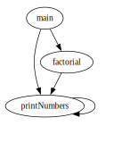

# Übung 04 *Maximilian Burger*
## Task 1
MiniC ist eine kleine Teilmenge von C, angelehnt an MiniPascal. Unten links ist ein einfaches MiniC-Programm zur Berechnung des Satzes von Pythagoras (SVP) dargestellt, rechts die Grammatik
von MiniC (die Sie auch im Moodle-Kurs in der Datei MiniC.syn finden):
```
MC =      "void" "main" "(" ")" "{"
          [ VarDecl ]
          StatSeq
          "}" .
VarDecl = "int" ident { "," ident } ";" .
StatSeq = Stat { Stat } .
Stat =    [ ident "=" Expr
          | "scanf"  "(" ident ")"
          | "printf" "(" Expr  ")"
          ] ";" .
Expr =    Term { ( "+" | "-" ) Term } .
Term =    Fact { ( "*" | "/" ) Fact } .
Fact =    ident | number | "(" Expr ")" . 
```
```c
/*SVP Satz 
von Pythagoras*/
void main() {
  int a, b, cs;
  scanf(a);
  scanf(b);
  cs = (a * a) + (b * b);
  printf(cs);
} /*main*/
```

### Erstellung des lexikalischen Analysators mit flex 2.6.4 

```c
/*MiniC.l:                                            HDO, 2006-2015
  -------
  Lex/Flex description for MiniC.
====================================================================*/

/*instead of function yywrap that returns 1:                        */
%option noyywrap 

%{

  #include "MiniC.tab.h" /*generated with "bison -d MiniC.y"        */

  extern int yylineno;   /*current line number, initalized with 1   */
  extern int yylval;     /*lexical attribute for current token      */
  extern int yyerror(char *msg); 


%}

%%

[ \t]+      { ; }        /*ignore white space: blanks and tabs      */

(\r\n|\n)   { yylineno++; } /*this also supports unix style line-endings*/

"/*"        {            /*skip C comments                          */
              int prevCh = 0, ch = input();
              while (1) {
                if (ch <= 0) { /* EOF == -1 */
                  yyerror("eof within comment"); /*see in MiniC.y   */
                  break;
                } /*if*/
                if (ch == '\n') /* unix-line-ending also contains '\n' */
                  yylineno++;
                else if (prevCh == '*' && ch == '/')
                  break; /*ok: correct end of comment               */
                prevCh = ch;
                ch = input();
              } /*while*/
            }


int         { return INT;    }
main        { return MAIN;   }
printf      { return PRINTF; }
scanf       { return SCANF;  }
void        { return VOID;   }

[a-zA-Z][a-zA-Z0-9]* { return IDENT; }

[0-9]+      { yylval = atoi(yytext); return NUMBER; }


.           { return yytext[0]; } /*return all other chars 
                                    as tokens to parser: '+', ...   */

%%

/* End of MiniC.l
====================================================================*/
```


### Erstellung des Parsers mit bison (GNU Bison) 3.8.2 

```c
/*MiniC.y:                                            HDO, 2006-2015
  -------
  Yacc/Bison attributed grammar for MinC.
====================================================================*/

%{

  #include <stdio.h>
  #include <stdlib.h>

  extern int yylineno;  /*current line number, initalized with 1    */
  extern int yylval;    /*lexical attribute for current token       */
  extern int yylex_destroy();

%}

%token INT
%token MAIN
%token PRINTF
%token SCANF
%token VOID

%token IDENT
%token NUMBER

%%

MC:
  VOID MAIN '(' ')' Block
  ;
  
Block:
  '{' OptVarDecl StatSeq '}'
  ;
  
OptVarDecl:
     /*epsilon*/
  |  INT IdList ';'
  ;
  
IdList:
    IDENT
  | IdList ',' IDENT
  ;
  
StatSeq:
    Stat
  | StatSeq Stat
  ;
  
Stat:
    ';'
  | IDENT '=' Expr       ';'
  | SCANF  '(' IDENT ')' ';'
  | PRINTF '(' Expr  ')' ';'
  | error ';'
  ;
  
Expr: 
    Term         
  | Expr '+' Term  
  | Expr '-' Term  
  ;

Term: 
    Fact         
  | Term '*' Fact  
  | Term '/' Fact  
  ;
  
Fact: 
    IDENT
  | NUMBER
  | '(' Expr ')'   
  ;
 
%%

extern FILE *yyin;     /*file to parse, stdin per default*/

int yyerror(char *msg) {
  printf("ERROR: %s in line %d\n", msg, yylineno);
  return 0;
} /*yyerror*/

int main(int argc, char *argv[]) {
  if (argc > 1) {
    FILE *fin = fopen(argv[1], "r");
    if (fin == NULL) {
      printf("ERROR: file %s not found\n", argv[1]);
      exit(-1);
    } /*if*/
    yyin = fin;
  } /*if*/
  yyparse();
  yylex_destroy();     /*free memory allocated by scanner*/
  printf("lines parsed: %d\n", yylineno);
  return 0;
} /*main*/


/* End of MiniC.y
====================================================================*/
```

### Build-Skript
```bash
#!/bin/bash

flex MiniC.l
bison -d -v -g -Wcounterexamples MiniC.y
gcc lex.yy.c MiniC.tab.c -o MiniC
./MiniC < SVP.mc
```

### Ausgabe
```
MiniC.tab.c: In function ‘yyparse’:
MiniC.tab.c:1029:16: warning: implicit declaration of function ‘yylex’ [-Wimplicit-function-declaration]
 1029 |       yychar = yylex ();
      |                ^~~~~
MiniC.tab.c:1164:7: warning: implicit declaration of function ‘yyerror’; did you mean ‘yyerrok’? [-Wimplicit-function-declaration]
 1164 |       yyerror (YY_("syntax error"));
      |       ^~~~~~~
      |       yyerrok
lines parsed: 9
```

## Task 2
### Teilaufgabe a)
Generieren Sie mit lex/flex einen lexikalischen Analysator (scanner), mit yacc/bison einen
Syntaxanalysator (parser) für MiniCpp, und bauen Sie daraus dann ein Analyseprogramm für
MiniCpp-Programme.

### Teilaufgabe b)
Erweitern Sie Ihre Grammatik aus a) zu einer ATG, sodass der (statische) Funktionsaufrufgraph des analysierten Programms erstellt wird. Gehen Sie dabei so vor, dass von der ATG eine Textdatei (.gv) für GraphViz (www.graphviz.org) erzeugt wird, aus der mit GVEdit, mit `dot.exe` direkt oder über www.webgraphviz.com eine Abbildung erzeugt werden kann.

#### Ablauf der Graphen-Erstellung
- Bei Programmstart wird eine GraphViz-Datei (`calls.gv`) initialisiert
- Während des Parsens wird die aktuelle Funktion in `currentFunction` gespeichert
- Bei jedem Funktionsaufruf wird eine Kante von der aktuellen zur aufgerufenen Funktion hinzugefügt
- Nach Abschluss des Parsens wird die GraphViz-Datei geschlossen


*folgende Ausarbeitung enthält bereits Teilaufgabe a) und b):* 


### Erstellung des lexikalischen Analysators mit flex 2.6.4 
```c
%option noyywrap

%{
#include "MiniCpp.tab.h"
extern int yylineno;   /*current line number, initalized with 1   */
%}

%%

[ \t\r]+    { ; }  /* ignore whitespace */
\n          { yylineno++; }

"/*"        {  /* skip C-style comments */
              int c;
              while((c = input()) != EOF) {
                if(c == '\n') 
                  yylineno++;
                else if(c == '*') {
                  if((c = input()) == '/')
                    break;
                  else
                    unput(c);
                }
              }
            }

"//"        {  /* skip C++ style comments */
              int c;
              while((c = input()) != EOF && c != '\n') 
                ;
              if(c == '\n') 
                yylineno++;
            }

"bool"      { return BOOL; }
"break"     { return BREAK; }
"cin"       { return CIN; }
"const"     { return CONST; }
"cout"      { return COUT; }
"delete"    { return DELETE; }
"else"      { return ELSE; }
"endl"      { return ENDL; }
"false"     { return FALSE; }
"if"        { return IF; }
"int"       { return INT; }
"new"       { return NEW; }
"nullptr"   { return NULLPTR; }
"return"    { return RETURN; }
"true"      { return TRUE; }
"void"      { return VOID; }
"while"     { return WHILE; }

[a-zA-Z][a-zA-Z0-9]*  { yylval.strval = strdup(yytext); return IDENT; }

[0-9]+      { yylval.intval = atoi(yytext); return NUMBER; }

\"[^\"]*\"  { return STRING; }  /* string literals */

"<<"        { return SHL; }
">>"        { return SHR; }
"+="        { return PLUSEQ; }
"-="        { return MINUSEQ; }
"*="        { return TIMESEQ; }
"/="        { return DIVEQ; }
"%="        { return MODEQ; }
"=="        { return EQ; }
"!="        { return NEQ; }
"<="        { return LEQ; }
">="        { return GEQ; }
"&&"        { return AND; }
"||"        { return OR; }
"++"        { return INC; }
"--"        { return DEC; }

[-+*/%=<>!&|(){}\[\];,]  { return yytext[0]; }

.           { printf("Unrecognized character: %s\n", yytext); }

%%
```

### Erstellung des Parsers mit bison (GNU Bison) 3.8.2 
```c
%{
#include <stdio.h>
#include <stdlib.h>
#include <string.h>

extern int yylineno;
extern int yylex();
extern int yyparse();
extern FILE *yyin;
extern char *yytext;

FILE* dotFile;
char currentFunction[256] = "";

void yyerror(const char *s);

void initGraph() {
    dotFile = fopen("calls.gv", "w");
    fprintf(dotFile, "digraph G {\n");
}

void closeGraph() {
    fprintf(dotFile, "}\n");
    fclose(dotFile);
}

void addEdge(const char* from, const char* to) {
    if (strlen(from) > 0) { 
        fprintf(dotFile, "  \"%s\" -> \"%s\";\n", from, to);
    }
}

void setCurrentFunction(const char* name) {
    strncpy(currentFunction, name, sizeof(currentFunction) - 1);
    currentFunction[sizeof(currentFunction) - 1] = '\0';
}

%}

%union {
    char* strval;  // For storing identifiers
    int intval;    // For NUMBER tokens
}

%token BOOL BREAK CIN CONST COUT DELETE ELSE ENDL FALSE IF INT
%token NEW NULLPTR RETURN STRING TRUE VOID WHILE
%token <strval> IDENT
%token <intval> NUMBER
%token SHL SHR PLUSEQ MINUSEQ TIMESEQ DIVEQ MODEQ
%token EQ NEQ LEQ GEQ AND OR INC DEC

%type <strval> FuncHead

%nonassoc LOWER_THAN_ELSE
%nonassoc ELSE

%%

MiniCpp     : /* empty */
            | MiniCpp TopLevel
            ;

TopLevel    : ConstDef
            | VarDef
            | FuncDecl
            | FuncDef
            | ';'
            ;

ConstDef    : CONST Type IdentInit ';'
            ;

IdentInit   : IDENT Init
            | IdentInit ',' IDENT Init
            ;

Init        : '=' InitValue
            ;

InitValue   : FALSE
            | TRUE
            | NULLPTR
            | OptSign NUMBER
            ;

OptSign     : /* empty */
            | '+'
            | '-'
            ;

VarDef      : Type VarList ';'
            ;

VarList     : VarItem
            | VarList ',' VarItem
            ;

VarItem     : OptPointer IDENT OptInit
            ;

OptPointer  : /* empty */
            | '*'
            ;

OptInit     : /* empty */
            | Init
            ;

FuncDecl    : FuncHead ';'
            ;

FuncDef     : FuncHead { setCurrentFunction($1); }  Block { setCurrentFunction(""); }
            ;

FuncHead    : Type OptPointer IDENT '(' OptFormParList ')' { $$ = strdup($3); }
            ;

OptFormParList : /* empty */
               | FormParList
               ;

FormParList : VOID
            | ParamDef
            | FormParList ',' ParamDef
            ;

ParamDef    : Type OptPointer IDENT OptArray
            ;

OptArray    : /* empty */
            | '[' ']'
            ;

Type        : VOID
            | BOOL
            | INT
            ;

Block       : '{' BlockItems '}'
            ;

BlockItems  : /* empty */
            | BlockItems BlockItem
            ;

BlockItem   : ConstDef
            | VarDef
            | Stat
            ;

Stat        : EmptyStat
            | BlockStat
            | ExprStat
            | IfStat
            | WhileStat
            | BreakStat
            | InputStat
            | OutputStat
            | DeleteStat
            | ReturnStat
            ;

EmptyStat   : ';'
            ;

BlockStat   : Block
            ;

ExprStat    : Expr ';'
            ;

IfStat      : IF '(' Expr ')' Stat              %prec LOWER_THAN_ELSE
            | IF '(' Expr ')' Stat ELSE Stat
            ;

WhileStat   : WHILE '(' Expr ')' Stat
            ;

BreakStat   : BREAK ';'
            ;

InputStat   : CIN SHR IDENT ';'
            ;

OutputStat  : COUT OutList ';'
            ;

OutList     : SHL OutExpr
            | OutList SHL OutExpr
            ;

OutExpr     : Expr
            | STRING
            | ENDL
            ;

DeleteStat  : DELETE '[' ']' IDENT ';'
            ;

ReturnStat  : RETURN OptExpr ';'
            ;

OptExpr     : /* empty */
            | Expr
            ;

Expr        : OrExpr
            | OrExpr AssignOp OrExpr
            ;

AssignOp    : '='
            | PLUSEQ
            | MINUSEQ
            | TIMESEQ
            | DIVEQ
            | MODEQ
            ;

OrExpr      : AndExpr
            | OrExpr OR AndExpr
            ;

AndExpr     : RelExpr
            | AndExpr AND RelExpr
            ;

RelExpr     : SimpleExpr
            | RelExpr RelOp SimpleExpr
            ;

RelOp       : EQ
            | NEQ
            | '<'
            | LEQ
            | '>'
            | GEQ
            ;

SimpleExpr  : OptSign Term
            | SimpleExpr AddOp Term
            ;

AddOp       : '+'
            | '-'
            ;

Term        : NotFact
            | Term MulOp NotFact
            ;

MulOp       : '*'
            | '/'
            | '%'
            ;

NotFact     : Fact
            | '!' Fact
            ;

Fact        : FALSE
            | TRUE
            | NULLPTR
            | NUMBER
            | LValue
            | NEW Type '[' Expr ']'
            | '(' Expr ')'
            ;

LValue      : OptInc IDENT OptPostInc
            | OptInc IDENT '[' Expr ']' OptPostInc
            | OptInc IDENT '(' { addEdge(currentFunction, $2); } OptActParams ')' OptPostInc
            ;

OptInc      : /* empty */
            | INC
            | DEC
            ;

OptPostInc  : /* empty */
            | INC
            | DEC
            ;

OptActParams: /* empty */
            | ActParams
            ;

ActParams   : Expr
            | ActParams ',' Expr
            ;

%%

void yyerror(const char *s) {
    fprintf(stderr, "Error: %s at line %d\n", s, yylineno);
}

int main(int argc, char **argv) {
    initGraph();  
    if (argc > 1) {
        if (!(yyin = fopen(argv[1], "r"))) {
            perror(argv[1]);
            return 1;
        }
    }

    if (yyparse() == 0) {
        printf("lines parsed: %d\n", yylineno);
        printf("Parsing completed successfully\n");
    }
    closeGraph();
    return 0;
}
```

### Build-Skript
```bash
#!/bin/bash

flex MiniCpp.l
bison -d -v -g -Wcounterexamples MiniCpp.y
gcc lex.yy.c MiniCpp.tab.c -o MiniCpp
./MiniCpp < plausible.mcpp
```

### Ausgabe
```
lines parsed: 34
Parsing completed successfully
```

### Testprogramm `plausible.mcpp`
```c
// Test program with function calls, recursion, and various MiniCpp features
void printNumbers(int n);  // declaration
void factorial(int n);     // declaration

void main() {
    int num;
    cout << "Enter a number: ";
    cin >> num;
    
    if (num > 0) {
        printNumbers(num);
        factorial(num);
    }
}

void printNumbers(int n) {
    if (n > 0) {
        cout << n << endl;
        printNumbers(n - 1);  // recursive call
    }
}

void factorial(int n) {
    int result;
    result = 1;
    
    while (n > 0) {
        result *= n;
        printNumbers(n);  // call to another function
        n--;
    }
    
    cout << "Result: " << result << endl;
}
```

